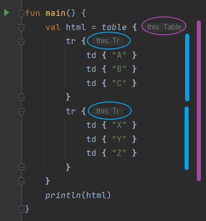

# DSL

> DSL 的全称是领域特定语言（Domain Specific Language），它是编程语言赋予开发者的一种特殊能力，通过它我们可以编写出一些看似脱离其原始语法结构的代码，从而构建出一种专有的语法结构。

在 Kotlin 中实现 DSL 的实现方式并不固定，使用 infix 函数构建出的特有语法结构就属于 DSL。不管你有没有察觉到，其实长久以来你一直都在使用 DSL。比如要在项目中添加一些依赖库，需要在 build.gradle 文件中编写如下内容：

```kotlin
dependencies {
    implementation '...'
    implementation '...'
}
```

Gradle 是一种基于 Groovy 语言的构建工具，因此上述的语法结构其实就是 Groovy 提供的 DSL 功能。借助 Kotlin 的 DSL，我们也可以实现类似的语法结构：

```kotlin
class Dependency {
    val libraries = ArrayList<String>()

    fun implementation(lib: String) {
        libraries.add(lib)
    }
}


fun dependencies(block: Dependency.() -> Unit): List<String> {
    val dependency = Dependency()
    dependency.block()
    return dependency.libraries
}
```

首先新建一个 Dependency 类，使用了一个 List 集合来保存所有的依赖库，还提供了一个 `implementation()` 方法，用于向 List 集合中添加依赖库。接下来定义一个 `dependencies` 高阶函数，接收一个定义到 Dependency 类里面的函数类型参数，因此调用它的时候需要先创建一个 Dependency 的实例，然后再通过该实例调用函数类型参数，从而使传入的 Lambda 表达式得到执行。最后将 Dependency 类中保存的依赖库集合返回。

经过这样的 DSL 设计之后，我们就可以在项目中使用如下的语法结构了：

```kotlin
dependencies {
    implementation ("...")
    implementation ("...")
}
```

由于 `dependencies` 函数接收一个函数类型参数，因此这里我们可以传入一个 Lambda 表达式。而此时的 Lambda 表达式中拥有 Dependency 类的上下文，因此当然就可以直接调用 Dependency 类中的 `implementation()` 方法来添加依赖库了。

## 实战

```html
<table>
  <tr>
    <td>A</td>
    <td>B</td>
    <td>C</td>
  </tr>
  <tr>
    <td>X</td>
    <td>Y</td>
    <td>Z</td>
  </tr>
</table>
```

这段代码会创建出一个两行三列的表格。如果现在有一个需求，要求我们在 Kotlin 中动态生成表格所对应的 HTML 代码，最简单直接的方式就是字符串拼接了，但是这种做法显然十分烦琐，而且字符串拼接的代码也难以阅读。如何借助 DSL 以一种不可思议的语法结构来动态生成表格所对应的 HTML 代码呢？

模拟上面实现的 `dependencies { implementation ("...") }` 语法，动态生成表格 HTML 代码，是否能像下面这么写呢？

```kotlin
table { 这里应该拥有 Table 对象的上下文环境
    tr { 这里应该拥有 Tr 对象的上下文环境
        td { "A" }
        td { "B" }
        td { "C" }
    }

    tr {
        td { "X" }
        td { "Y" }
        td { "Z" }
    }
}
```

我们由内而外来分析一下代码，首先，`td { "A" }` 肯定是会生成一个 Td 对象，而且是在调用高阶函数 `tr` 传入的 lambda 表达式中调用的，那么这个 lambda 表达式应该是拥有 Tr 的上下文，调用多个 `td { "..." }` 就意味着创建多个 Td 对象并把它们都加入到上下文对象 Tr 里面。

同理，在调用高阶函数 `table` 时，传入的 lambda 表达式多次调用 `tr { ... }`，这个 lambda 表达式里应该是拥有 Table 上下文的，多次调用 `tr { ... }` 就意味着创建多个 Tr 对象并添加到上下文对象 Table 里面。

好，分析完了我们开始动手：

```kotlin
class Td(private val content: String) {
    fun html() = "<td>$content</td>"
}

class Tr {
    private val children = ArrayList<Td>()

    fun td(block: () -> String) {
        val td = Td(block())
        children.add(td)
    }

    fun html(): String {
        val builder = StringBuilder()
        builder.append("<tr>")
        for (td in children){
            builder.append(td.html())
        }
        builder.append("</tr>")
        return builder.toString()
    }
}
```

先创建 Td 类，可以传入单元格内容字符串来实例化一个 Td 对象，还创建了一个 `html()` 方法用于返回 HTML 代码。

Tr 类复杂一点。由于 <tr\> 标签可以包含多个 <td\> 标签，因此先创建了一个 children 集合，用于存储当前 Tr 所包含的 Td 对象。接下来提供了一个 `td()` 函数，它接收一个返回值是 String 的函数类型参数。当调用 `td()` 函数时，会利用函数类型参数返回的 String 来创建一个 Td 对象，然后将它添加到 children 集合中，此外还有一个 `html()` 方法也是用于返回 HTML 代码，不必多说。

现在可以使用如下的语法格式来构建表格中的一行数据：

```kotlin
val tr = Tr()
tr.td { "A" }
tr.td { "B" }
tr.td { "C" }
```

好像已经有那么回事了，但这仍然不是我们追求的最终效果，我们继续：

```kotlin
class Table {
    private val children = ArrayList<Tr>()

    fun tr(block: Tr.() -> Unit) {
        val tr = Tr()
        tr.block()
        children.add(tr)
    }

    fun html(): String {
        val builder = StringBuilder()
        builder.append("<table>")
        for (tr in children){
            builder.append(tr.html())
        }
        builder.append("</table>")
        return builder.toString()
    }
}
```

和刚才 Tr 类中的代码是比较相似。Table 类中同样创建了一个 children 集合，用于存储当前 Table 所包含的 Tr 对象。然后定义了一个 `tr()` 函数，接收一个定义到 Tr 类中的函数类型参数。调用 `tr()` 函数时，会先创建一个 Tr 对象并用它来调用函数类型参数。将创建的 Tr 对象添加到 children 集合。

现在，我们就可以使用如下的语法结构来构建一个表格了：

```kotlin
val table = Table()

table.tr {
    td { "A" }
    td { "B" }
    td { "C" }
}

table.tr {
    td { "X" }
    td { "Y" }
    td { "Z" }
}
```

这段代码看上去已经相当不错了，不过和预期的目标仍有差距，我们还可以再进一步对语法结构进行精简：

```kotlin
fun table(block: Table.() -> Unit): String {
    val table = Table()
    table.block()
    return table.html()
}
```

`table()` 函数接收一个定义到 Table 类中的函数类型参数，调用 `table()` 函数时，先创建一个 Table 对象并用它来调用函数类型参数。最后返回 Table 的 `html()` 方法生成的 HTML 代码。

现在我们终于可以使用如下神奇的语法结构来动态生成一个表格所对应的 HTML 代码了：

```kotlin
fun main() {
    val html = table {
        tr {
            td { "A" }
            td { "B" }
            td { "C" }
        }
        tr {
            td { "X" }
            td { "Y" }
            td { "Z" }
        }
    }
    println(html)
}
```


