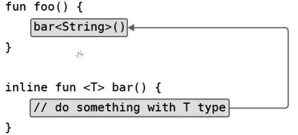
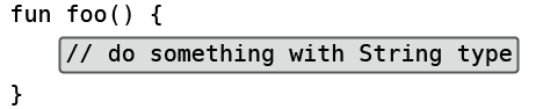
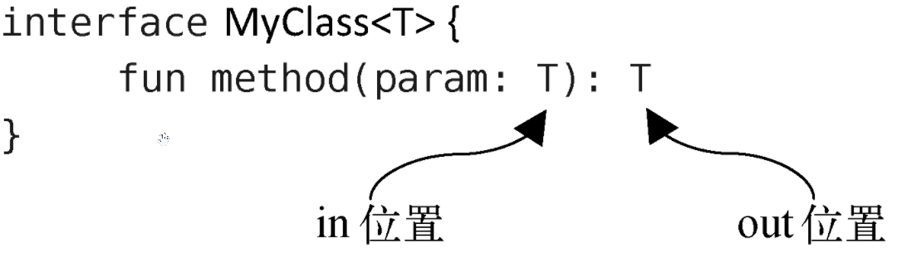
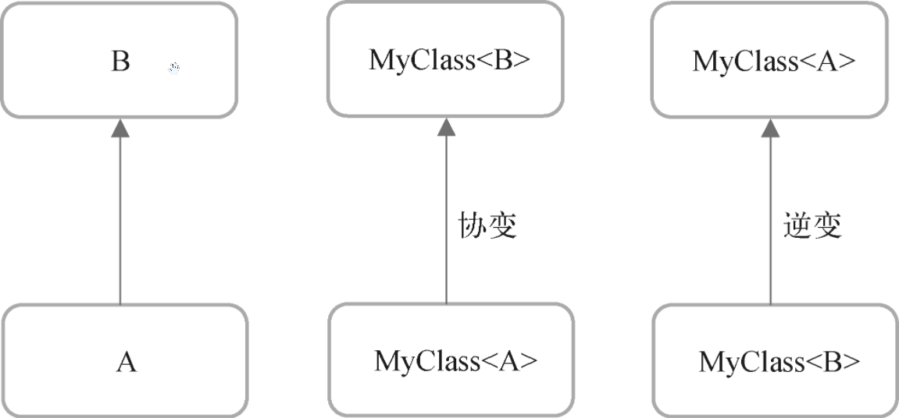
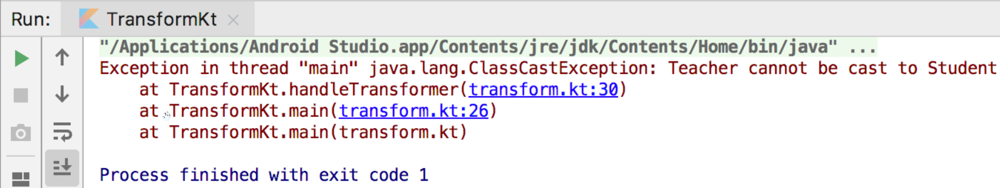

# 泛型的高级特征


## 1. 泛型实化

要深刻理解泛型实化，我们得先解释一下 Java 的泛型擦除机制（虽然 Java 中没有泛型实化的概念）


### 1.1 Java 的泛型擦除机制

在 JDK 1.5 之前，Java是没有泛型功能的，彼时诸如 List 之类的数据结构可以存储任意类型的数据，取出数据的时候也需要手动向下转型才行。直到 JDK 1.5，Java 才引入泛型功能。

Java 的泛型功能是通过类型擦除机制来实现的。什么意思呢？就是说泛型对于类型的约束只在编译时期存在，运行时仍然会按照 JDK 1.5之前的机制来运行，JVM 是识别不出来我们在代码中指定的泛型类型的。例如，假设我们创建了一个List\<String> 集合，虽然在编译时期只能向集合中添加字符串类型的元素，但是在运行时期 JVM并不能知道它本来只打算包含哪种类型的元素，只能识别出来它是个 List。

所有基于 JVM 的语言，它们的泛型功能都是通过类型擦除机制来实现的，其中当然也包括了 Kotlin。这种机制使得我们不可能使用 `a is T` 或者 `T::class.java` 这样的语法，因为 T 的实际类型在运行的时候已经被擦除了。


### 1.2 内联函数对泛型的影响

Kotlin 提供了一个内联函数的概念。内联函数中的代码会在编译的时候自动被替换到调用它的地方，这样的话也就不存在什么泛型擦除的问题了，因为代码在编译之后会直接使用实际的类型来替代内联函数中的泛型声明。



最终代码：




可以看到，`bar()` 是一个带有泛型类型的内联函数，`foo()` 调用了 `bar()` 函数，在代码编译之后，`bar()` 中的代码将可以获得泛型的实际类型。这就意味着，Kotlin 中是可以将内联函数中的泛型进行实化的。


### 1.3 具体实现

具体怎么写才能将泛型实化呢？首先，该函数必须是内联函数才行，也就是要用 `inline` 关键字来修饰该函数。其次，在声明泛型的地方必须加上 `reified` 关键字来表示该泛型要进行实化：

```kotlin
inline fun <reified T> getGenericType(){
}
```

上述函数中的泛型 T 就是一个被实化的泛型，因为它满足了**内联函数**和 **`reified`** 关键字这两个前提条件。那么借助泛型实化，到底可以实现什么样的效果呢？从函数名就可以看出来了，这里我们准备实现一个获取泛型实际类型的功能，代码如下所示：

```kotlin
inline fun <reified T> getGenericType() = T::class.java
```

虽然只有一行代码，但是这里却实现了一个 Java 中完全不可能实现的功能：`getGenericType()` 直接返回了当前指定泛型的实际类型。`T.class` 这样的语法在Java中是不合法的，而在 Kotlin 中，借助泛型实化功能就可以使用 `T::class.java` 这样的语法了。


## 2. 泛型实化的应用

Android 的四大组件除了 ContentProvider 之外，其余的3个组件有一个共同的特点：都要结合 Intent 一起使用。

```kotlin
val intent = Intent(context, TestActivity::class.java)
context.startActivity(intent)
```

有没有觉得 `TestActivity::class.java` 这样的语法很难受呢？Kotlin 的泛型实化功能使得我们拥有了更好的选择。

```kotlin
inline fun <reified T> startActivity(context: Context){
    val intent = Intent(context, T::class.java)
    context.startActivity(intent)
}
```

这里我们定义了一个 `startActivity()` 函数，该函数接收一个 Context 参数，并同时使用 `inline` 和 `reified` 关键字让泛型 T 成为了一个被实化的泛型。接下来就是神奇的地方了，Intent 接收的第二个参数本来应该是一个具体 Activity的 Class 类型，但由于现在 T 已经是一个被实化的泛型了，因此这里我们可以直接传入 `T::class.java`。最后调用 Context 的 `startActivity()` 来完成 Activity 的启动。现在，如果我们想要启动 TestActivity，只需要这样写就可以了：

```kotlin
startActivity<TestActivity>(context)
```

Kotlin 将能够识别出指定泛型的实际类型，并启动相应的 Activity。

不过，现在的 `startActivity()` 函数其实还是有问题的，因为通常在启用 Activity 的时候还可能会使用 Intent 附带一些参数，比如：`intent.putExtra("param1", 123)`，经过刚才的封装之后，我们就无法进行传参了。

其实也不难解决，只需要借助高阶函数就可以轻松搞定。添加一个新的 startActivity() 函数重载，如下所示：

```kotlin
inline fun <reified T> startActivity(context: Context, block: Intent.() -> Unit){
    val intent = Intent(context, T::class.java)
    intent.block()
    context.startActivity(intent)
}
```

可以看到，这次的 `startActivity()` 函数中增加了一个函数类型参数，并且它的函数类型是定义在 Intent 类当中的。在创建完 Intent 实例后，随即调用该函数类型参数，并把 Intent 实例传入，这样调用 `startActivity()` 函数的时候就可以在 Lambda 表达式中为 Intent 传递参数了，如下所示：

```kotlin
startActivity<TestActivity>(context) {
    putExtra("param1", 123)
}
```


## 3. 泛型的协变

学习协变和逆变前，先得先了解一个约定。一个**泛型类或者泛型接口中的方法**，它的参数列表是接收数据的地方，称为 in 位置，而它的返回值是输出数据的地方，称为 out 位置：



好，有了这个约定前提，我们继续。

```kotlin
open class Person(val name: String, val age: Int)
class Student(name: String, age: Int) : Person(name, age)
class Teacher(name: String, age: Int) : Person(name, age)
```

这里首先定义了一个 Person 类，然后又定义了 Student 和 Teacher 这两个类作为 Person 类的子类。这时如果某个方法接收一个 List<Person\> 类型的参数，而我们传入一个 List<Student\> 的实例，这样合不合法呢？Java 中是不允许的，因为 List<Student\> 不能成为 List<Person\> 的子类，否则将可能存在类型转换的安全隐患。下面我们用一个具体的例子进行说明。这里自定义一个 SimpleData 类，代码如下所示：

```kotlin
class SimpleData<T> {
    private var data: T? = null
    
    fun set(t: T?) {
        data = t
    }
    
    fun get() = data
}
```

接着我们**假设**，如果编程语言允许向某个接收 SimpleData<Person\> 参数的方法传入 SimpleData<Student\> 的实例，那么如下代码就会是合法的：

```kotlin
fun main() {
    val student = Student("Tom", 18)
    val data = SimpleData<Student>()
    data.set(student)
    handleSimpleData(data) // 实际上这行会报错
    val studentData = data.get()
}

fun handleSimpleData(data: SimpleData<Person>) {
    val teacher = Teacher("Mike", 35)
    data.set(teacher)
}
```

在main() 方法中，我们创建了一个 Student 的实例，将它封装到 `SimpleData<Student>` 中并作为参数传递给 `handleSimpleData(data: SimpleData<Person>)` 方法。（这里假设可以编译通过）。

那么在 handleSimpleData() 方法中，我们创建一个 Teacher 的实例，并用它来替换 SimpleData<Person\> 参数中的原有数据。这种操作肯定是合法的，因为 Teacher 也是 Person 的子类。但是问题马上来了，回到 main() 方法当中，我们调用 SimpleData<Student\> 的 get() 方法来获取它内部封装的 Student 数据，可现在 SimpleData<Student\> 中实际包含的却是一个 Teacher 的实例，那么此时必然会产生类型转换异常。所以，为了杜绝这种安全隐患，Java 是不允许使用这种方式来传递参数的。

换句话说，即使 Student 是 Person 的子类，SimpleData<Student\> 并不是 SimpleData<Person\> 的子类。


回顾一下刚才的代码，问题发生的主要原因是在 handleSimpleData() 方法中向 SimpleData<Person\> 里设置了一个 Teacher 的实例。如果 SimpleData 在泛型 T 上是只读的话，肯定就没有类型转换的安全隐患了，解决了这个问题后 SimpleData<Student\> 可不可以成为 SimpleData<Person\> 的子类呢？讲到这里，我们终于要引出泛型协变的定义了：

**假如定义了一个 MyClass<T\> 的泛型类，其中 A 是 B 的子类，同时 MyClass<A\> 又是 MyClass<B\> 的子类型，那么我们就可以称 MyClass 在 T 这个泛型上是协变的。**

让 A 是 B 的子类很简单，但如何才能让 MyClass<A\> 成为 MyClass<B\> 的子类型呢？刚才已经讲了，如果一个泛型类在其泛型类型的数据上是只读的话，那么它是没有类型转换安全隐患的。而要实现这一点，则需要让 MyClass<T\> 类中的所有方法都不能接收 T 类型的参数，换句话说，T 只能出现在 out 位置上，而不能出现在 in 位置上。现在修改 SimpleData 类的代码：

```kotlin
class SimpleData<out T>(val data: T?) {
    
    fun get() = data
}
```

在泛型 T 的声明前面加上了一个 `out` 关键字。这就意味着现在 T 只能出现在 out 位置上，而不能出现在 in 位置上，同时也意味着 SimpleData 在泛型 T 上是协变的。

由于泛型 T 不能出现在 in 位置上，因此我们也就不能使用 set() 方法为 data 参数赋值了，所以这里改成了使用构造函数的方式来赋值。你可能会说，构造函数中的泛型 T 不也是在in位置上的吗？没错，但是由于这里我们使用了 `val` 关键字，所以构造函数中的泛型 T 仍然是只读的，因此这样写是合法且安全的。另外，即使使用 `var` 关键字，但只要给它加上 `private` 修饰符，保证这个泛型 T 对于外部而言是不可修改的，那么就都是合法的。

```kotlin
fun main() {
    val student = Student("Tom", 18)
    val data = SimpleData<Student>()
    data.set(student)
    handleSimpleData(data)
    val studentData = data.get()
}

fun handleSimpleData(data: SimpleData<Person>) {
    val personData = data.set(teacher)
}
```

由于 SimpleData 类已经进行了协变声明，那么 SimpleData<Student\> 自然就是 SimpleData<Person\> 的子类了，所以这里可以安全地向 `handleMyData(data: SimpleData<Person>)` 方法中传递 `SimpleData<Student>` 。然后在 handleMyData() 方法中去获取 SimpleData 封装的数据，虽然这里泛型声明的是 Person 类型，实际获得的会是一个 Student 的实例，但由于 Person 是 Student 的父类，向上转型是完全安全的，所以这段代码没有任何问题。


### 3.1 List

前面提到，如果某个方法接收一个 List<Person\> 类型的参数，而传入的却是一个 List<Student\> 的实例， 在 Java 中是不允许的。但在 Kotlin 中这么做是合法的，因为 Kotlin 已经默认给许多内置的 API 加上了协变声明，其中就包括了各种集合的类与接口。Kotlin 中的 List 本身就是只读的，如果你想要给 List 添加数据，需要使用 MutableList 才行。既然 List 是只读的，也就意味着它天然就是可以协变的，我们来看一下 List 简化版的源码：

```kotlin
public interface List<out E> : Collection<E> {
    overrride val size: Int
    overrride fun isEmpty(): Boolean
    override fun contains(element: @UnsafeVariance E): Boolean
    override fun iterator() : Iterator<E>
    public operator fun get(index: Int): E
}
```

List 在泛型 E 的前面加上了 out 关键字，说明 List 在泛型 E 上是协变的。原则上在声明了协变之后，泛型 E 就只能出现在 out 位置上，可是在 contains() 方法中，泛型 E 仍然出现在了 in 位置上。这么写本身是不合法的，因为在in位置上出现了泛型E就意味着会有类型转换的安全隐患。但是 contains() 方法的目的非常明确，它只是为了判断当前集合中是否包含参数中传入的这个元素，而并不会修改当前集合中的内容，因此这种操作实质上又是安全的。为了让编译器能够理解我们的这种操作是安全的，这里在泛型 E 的前面又加上了一个 `@UnsafeVariance` 注解，这样编译器就会允许泛型 E 出现在in位置上了。如果滥用这个功能，导致运行时出现了类型转换异常，Kotlin 对此是不负责的。


## 4. 泛型的逆变

**假如定义了一个 MyClass<T\> 的泛型类，其中 A 是 B 的子类型，同时 MyClass<B\> 又是 MyClass<A\> 的子类型，那么我们就可以称 MyClass 在 T 这个泛型上是逆变的。**

仅从定义上来看，逆变与协变完全相反。



从直观的角度上来思考，逆变的规则好像挺奇怪的，原本 A 是 B 的子类型，怎么 MyClass<B\> 能反过来成为 MyClass<A\> 的子类型了呢？下面我们通过一个具体的例子来学习一下。

```kotlin
interface Transformer<T> {
    fun transform(t: T): String
}
```

Transformer 接口中声明了一个 transform() 方法，接收一个 T 类型的参数，并返回一个 String 类型的数据，这意味着参数 T 在经过 transform() 方法的转换之后将会变成一个字符串。现在我们就尝试对接口进行实现：

```kotlin
fun main() {
    // Person 转换器
    val trans = object : Transformer<Person> {
        override fun transform(t: Person): String = "${t.name} ${t.age}"
    }
    handleTransformer(trans) // 报错
}

// 接收一个 Student 转换器
fun handleTransformer(trans: Transformer<Student>) {
    val student = Student("Tom", 20)
    val result = trans.transform(student)
}
```

首先在 main() 方法中编写了一个 Transformer<Person\> 的匿名类实现，并通过 transform() 方法将传入的 Person 对象转换成了一个“姓名+年龄”拼接的字符串。

handleTransformer() 方法接收的是 Transformer<Student\> 类型的参数，这里在 handleTransformer() 方法中创建了一个 Student 对象，并调用参数的 transform() 方法将 Student 对象转换成一个字符串。这段代码从安全的角度来分析是没有任何问题的，因为 Student 是 Person 的子类，使用 Transformer<Person\> 的匿名类实现将 Student 对象转换成一个字符串也是绝对安全的，并不存在类型转换的安全隐患。但是实际上，在调用 handleTransformer() 方法的时候却会提示语法错误，原因也很简单，Transformer<Person\> 并不是 Transformer<Student\> 的子类型。

这个时候逆变就可以派上用场了，它就是专门用于处理这种情况的。修改 Transformer 接口中的代码：

```kotlin
interface Transformer<in T> {
    fun transform(t: T): String
}
```

我们在泛型 T 的声明前面加上了一个 `in` 关键字。这就意味着现在 T 只能出现在 in 位置上，而不能出现在 out 位置上，同时也意味着 Transformer 在泛型 T 上是逆变的。没错，只要做了这样一点修改，刚才的代码就可以编译通过且正常运行了，因为此时 Transformer<Person\> 已经成为了 Transformer<Student\> 的子类型。逆变的用法大概就是这样。

------


如果还想再深入思考一下的话，可以想想为什么逆变的时候泛型T不能出现在 out 位置上？为了解释这个问题，我们先假设逆变是允许让泛型 T 出现在 out 位置上的，然后看一看可能会产生什么样的安全隐患：

```kotlin
interface Transformer<in T> {
    fun transform(name: String, age: Int): @UnsafeVariance T
}
```

我们将 transform() 方法改成了接收 name 和 age 这两个参数，并把返回值类型改成了泛型 T。由于逆变是不允许泛型 T 出现在 out 位置上的，这里为了能让编译器正常编译通过，所以加上了 `@UnsafeVariance` 注解。那么，这个时候可能会产生什么样的安全隐患呢？我们来看一下如下代码就知道了：

```
fun main() {
	val trans = object: Transformer<Person> {
		override fun transform(name: String, age: Int): Person = Teacher(name, age)
	}
	handleTransformer(trans)
}

fun handleTransformer(trans: Transformer<Student>) {
	val result = trans.transform("Tom", 19)
}
```

上述代码就是一个典型的违反逆变规则而造成类型转换异常的例子。在 Transformer<Person\> 的匿名类实现中，我们使用 transform() 方法中传入的 name 和 age 参数构建了一个 Teacher 对象，并把这个对象直接返回。由于 transform() 方法的返回值要求是一个 Person 对象，而 Teacher 是 Person 的子类，因此这种写法肯定是合法的。但在 handleTransformer() 方法当中，我们调用了 Transformer<Student\> 的 transform() 方法，并传入了 name 和 age 这两个参数，期望得到的是一个 Student 对象的返回，然而实际上 transform() 方法返回的却是一个 Teacher 对象，因此这里必然会造成类型转换异常。由于这段代码是可以编译通过的，运行一下，打印出的异常信息如下所示：



可以看到，提示我们 Teacher 是无法转换成 Student。也就是说，Kotlin 在提供协变和逆变功能时，就已经把各种潜在的类型转换安全隐患全部考虑进去了。只要我们严格按照其语法规则，让泛型在协变时只出现在 out 位置上，逆变时只出现在 in 位置上，就不会存在类型转换异常的情况。虽然 `@UnsafeVariance` 注解可以打破这一语法规则，但同时也会带来额外的风险，所以你在使用注解时，必须很清楚自己在干什么。


### 4.1 Comparable

逆变功能在 Kotlin 内置 API 中的应用，比较典型的例子就是 Comparable，这是一个用于比较两个对象大小的接口：

```kotlin
interface Comparable<in T> {
    operator fun comparTo(other: T): Int
}
```

可以看到，Comparable在 T 这个泛型上就是逆变的，`compareTo()` 方法则用于实现具体的比较逻辑。这里为什么要让 Comparable 接口是逆变的呢？想象如下场景：如果使用 `Comparable<Person>` 实现了让两个 Person 对象比较大小的逻辑（Person 比较器），那么用这个 Person 比较器去比较两个 Student 对象的大小也一定是成立的，因此让 `Comparable<Person>` 成为 `Comparable<Student>` 的子类合情合理。

下面我们通过一个简单的例子来更仔细讲一下：

```kotlin
fun main() {
    val personAntiAddiction = object : Comparable<Person> {
        override fun compareTo(other: Person): Int = if(other.age >= 18) 1 else 0
    }
    isStuMature(personAntiAddiction)
}


fun isStuMature(studentAntiAddiction: Comparable<Student>) {
    val student = Student("Alice", 18)
    val result = studentAntiAddiction.compareTo(student)
    when(result) {
        0 -> println("Student ${student.name} is still underage.")
        else -> println("Student ${student.name} is an adult.")
    }
}
```

首先，我们创建一个匿名对象 `personAntiAddiction `（“人类防沉迷器”），实现 `Comparable` 接口并在 `compareTo` 中判断 Person 是否成年，成年就返回1，否则返回0。我们还创建了一个 `isStuMature()` 方法，接收一个“学生防沉迷器”并利用它来判断一个 Student 是否已经成年并打印结果。我们把“人类防沉迷器”传递给 `isStuMature()`，因为学生也是人，所以使用“人类防沉迷器”去判断学生是否成年完全是没问题的。
