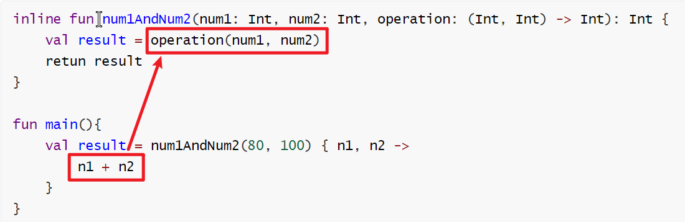
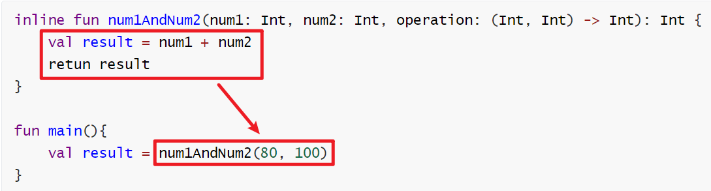

# 高阶函数


## 高阶函数的定义

> 如果一个函数接收另外一个函数作为参数，或返回值的类型式另一个函数，那么该函数就称为高阶函数。


编程语言中有字段类型（整形、布尔型...），Kotlin 中新增了 ”函数类型“ 的概念，如果将这种函数类型添加到一个函数的参数声明或返回值声明中，那么这就是一个高阶函数。函数类型的基本语法规则如下：

```kotlin
(String, Int) -> Unit
```

`->` 左边声明函数接收参数的类型，`->` 右边声明函数的返回类型


高阶函数的用途很广，但概括来说，它允许让（函数类型的）参数来决定函数的执行逻辑。即使是同一个高阶函数，只要传入不同的函数类型参数，那么它的执行逻辑和最终返回结果就有可能是完全不同的。

```kotlin
fun num1AndNum2(num1: Int, num2: Int, operation: (Int, Int) -> Int): Int{
    retun operation(num1, num2)
}

fun plus(num1: Int, num2: Int) = num1 + num2
fun minus(num1: Int, num2: Int) = num1 - num2

val result1 = num1AndNum2(80, 100, ::plus)
val result2 = num1AndNum2(80, 100, ::minus)
```

::function 是一种函数引用的写法，`::plus` 和 `::minus` 表示将 `plus()` 和 `minus()` 函数作为参数传递给 `num1AndNum2()` 函数，这种函数引用的写法是能正常工作，但如果每次调用高阶函数时都还得事先定义一个与其函数类型参数相匹配得函数，是不是有些麻烦？Kotlin 其实还支持其他多种方式来调用高阶函数，如 Lambda 表达式、匿名函数、成员引用...


利用 Lambda 表达式来实现上述代码：

```kotlin
val result1 = num1AndNum2(80, 100){ n1, n2 ->
	n1 + n2
}
val result2 = num1AndNum2(80, 100){ n1, n2 ->
	n1 - n2
}
// Lambda 表达式的最后一行会自动作为返回值
```


下面我们继续对高阶函数进行探究，利用高阶函数去实现类似 apply 函数的功能。

```kotlin
fun StringBuilder.build(block: StringBuilder.() -> Unit): StringBuilder {
    /**
     * 因为这是 StringBuilder 的拓展函数，所以这里拥有 StringBuilder 的上下文环境（this）。
     * 而我们又将 block() 定义在 StringBuilder 类中
     * 所以这里的 block()  <==>  this.block()
     * 换句话说，就是在 StringBuilder 上下文环境中去调用 block()
     */
    block()
    return this
}


fun main() {
    val x = StringBuilder().build {
        // 传入的 Lambda 表达式里将拥有 StringBuilder 的上下文
        append("Hi! ")
        append("How R U?")
    }
    println(x.toString())
}
```

注意函数类型参数的声明，在函数类型的前面多了 `StringBuilder.`。在函数类型前加上`ClassName.`，代表这个函数类型定义在哪个类当中。这样做的好处是，传入的 Lambda 表达式将拥有这个类的上下文。


## 内联函数 inline

在认识内联函数前，我们先来简单分析一下高阶函数的实现原理。

使用前面的函数为例子：

```kotlin
fun num1AndNum2(num1: Int, num2: Int, operation: (Int, Int) -> Int): Int{
    retun operation(num1, num2)
}

fun main(){
    val result = num1AndNum2(80, 100){ n1, n2 ->
		n1 + n2
	}
}
```

Java 中并没有高阶函数这个概念，Kotlin 会将高阶函数的语法转换成 Java支持的语法，上面的代码<u>大致上</u>会被转换成如下 Java 代码：

```java
public static int num1AndNum2(int num1, int num2, Function operation){
    int result = (int) operation.invoke(num1, num2);
    return result;
}

public static void main(){
    int result = num1AndNum2(80, 100, new Function(){
       @override
        public Integer invoke(Integer n1, Integer n2) {
            return n1 + n2;
        }
    });
}
```

可以看到，在这里 `num1AndNum2()` 的第三个参数变成了一个 Function 接口，这是一种 Kotlin 内置接口，里面有一个待实现的 invoke() 函数。而 `num1AndNum2()` 函数其实就是调用了 Function 接口的 invoke() 函数。

在调用 `num1AndNum2()` 时，之前的 Lambda 表达式变成了 Function 接口的匿名类实现，然后在 invoke() 函数中实现逻辑。

这就是 Kotlin 高阶函数背后的实现原理，我们一直使用的 Lambda 表达式在底层被转换成了匿名类的实现方式，这表明，我们每一次调用 Lambda 表达式，都会创建一个新的匿名类实例，从而造成额外的内存和性能开销。

为了解决这个问题， Kotlin 提供了内涵函数，它可以将 Lambda 表达式所带来的运行时开销完全消除。

```kotlin
inline fun num1AndNum2(num1: Int, num2: Int, operation: (Int, Int) -> Int): Int{
    retun operation(num1, num2)
}
```

内联函数用法非常简单，只需在定义高阶函数时加上 `inline` 关键字的声明。


内联函数的原理非常简单：Kotlin 编译器会将内联函数中的代码在编译时自动替换到调用它的地方。

首先，Kotlin 会将 Lambda 表达式中的代码替换到函数类型参数调用的地方。



然后，再将内联函数中的全部代码替换到内联函数被调用的地方。




## noinline 和 crossinline

### noinline

一个高阶函数如果接收了多个函数类型参数，这时给函数加上 `inline` 关键字，Kotlin 编译器就会将所有引用的 Lambda 表达式全部进行内联，但如果我们只想内联其中一个 Lambda 表达式那该怎么办？这时可以使用 `noinline` 关键字。

```kotlin
inline fun inlineTest(block1: () -> Unit, noinline block2: () -> Unit){
    
}
```

既然内联函数能将 Lambda 表达式所带来的运行时开销完全消除，为什么 Kotlin 还要提供 `noinline` 关键字来排除内联功能呢？这时因为**内联的函数类型参数在编译时会被代码替换，因而它没有真正的参数属性。**非内联的函数类型参数可以自由地传递给其他任何参数，因为它就是一个真实的参数，而内联的函数类型参数只允许传递给另外一个内联函数。

此外，内联函数与非内联函数还有一个重要区别，内联函数所引用的 Lambda 表达式中可以使用 `return` 关键字来进行函数返回，而非内联函数只能进行局部返回，我们来看下面的例子：

```kotlin
// main()  <==  printString()  <==  lambda 
fun printString(str: String, block: (String) -> Unit){
    println("printString start")
    block(str)
    println("printString end")
}

fun main(){
    println("main start")
    printString(""){ s ->
        println("lambda start")
        /**
         * 非内联函数所引用的 lambda 表达式中不允许直接使用 return 关键字的，
         * 这里使用 return@printString 的写法，表示局部返回，
         * 不再执行 lambda 表达式的剩余部分代码
         */
        if(s.isEmpty()) return@printString
        println(s)
        println("lambda end")
    }
    println("main end")
}

// 结果
main start
printString start
lambda start
printString end
main end
```

如果将 `printString()` 声明成一个内联函数，结果又会是怎么样呢？

```kotlin
inline fun printString(str: String, block: (String) -> Unit){
    println("printString start")
    block(str)
    println("printString end")
}

fun main(){
    println("main start")
    printString(""){ s ->
        println("lambda start")
        if(s.isEmpty()) return
        println(s)
        println("lambda end")
    }
    println("main end")
}

// 结果
main start
printString start
lambda start
```

将 `printString()` 声明为内联函数后，我们就可以在 Lambda 表达式中使用 `return` 关键字了，此时的 `return` 代表的是返回返回外层调用的函数，也就是 `main()` 函数。


### crossinline

将高阶函数声明成内联函数是一种良好的编程习惯。绝大多数的高阶函数是可以直接声明为内联函数的，但也有少部分例外情况：

```kotlin
inline fun runRunnable(block: () -> Unit){
    val runnable = Runnable {
        block()
    }
    runnable.run()
}
```

这个函数如果声明为内联函数，那么就会报错 Can‘t inline 'block' here.

我们来分析一下为什么声明为内联函数就报错呢？首先，在 `runRunnable()` 函数中我们创建了一个 Runnable 对象，并在 Runnable 的 Lambda 表达式中调用了传入的函数类型参数。 Runnable 的 Lambda 表达式在编译时会被转换为匿名类的实现方式，也就是说，上述代码实际上是在匿名类中调用了传入的函数类型参数。

内联函数所引用的 Lambda 表达式（block）是允许使用 return 关键字进行函数返回的，但由于我们是在匿名类中调用函数类型参数，此时是不可能进行外层调用函数返回的，最多只能对匿名类中的函数调用进行返回，因此这里就出现了报错。

main()  <==  runRunnable()  <=xx=  匿名类Runnable  <== lambda (return)

也就是说，如果我们在内联的高阶函数中创建了另外的 Lambda 或者匿名类的实现，并且在这些实现中调用了函数类型参数，就会报错。

有没有解决办法？答案是有的，可以使用 `crossinline` 关键字。

```kotlin
inline fun runRunnable(crossinline block: () -> Unit) {
    val runnable = Runnable {
        block()
    }
    runnable.run()
}
```

这个 `crossinline` 是啥，为什么加上它就能解决报错？根据前面的分析，之所以会报错，是因为内联函数的 Lambda 表达式（block）中允许使用 `return` 关键字，而高阶函数的匿名类实现中不允许使用 `return` 关键字，二者之间造成冲突。crossinline 就像一份锲约，保证在内联函数引用的 Lambda 表达式中一定不会包含 `return` 关键字，冲突就不存在了。

声明了 `crossinline` 后，我们无法在调用 runRunnable 的 Lambda 表达式中使用 `return` 关键字进行返回，不过可以使用 `return@runRunnable` 的写法进行局部返回。